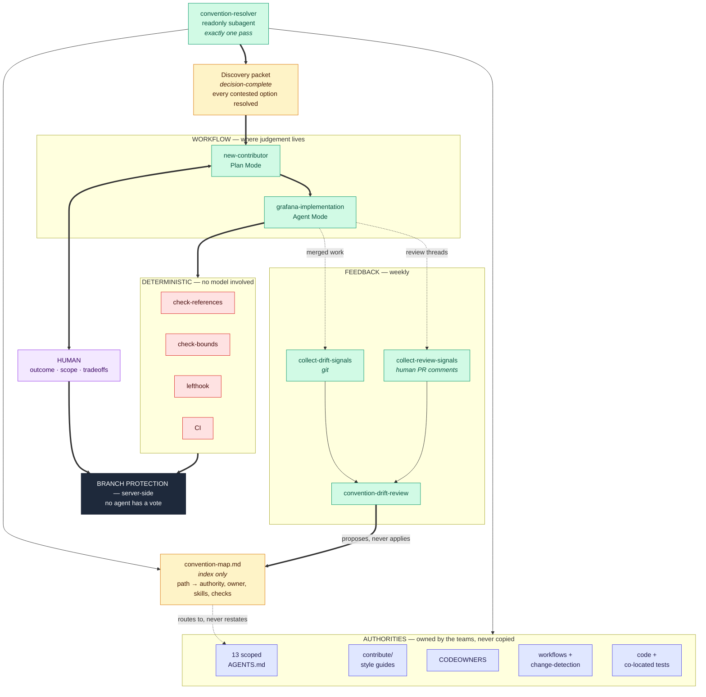
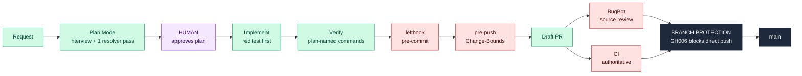

# Cursor agent workflow

An agent-assisted contribution workflow for this repository. It exists so that
someone who has never worked in Grafana can land a correct first change without
reading the whole codebase first, and so that an agent working here produces
evidence a reviewer can check rather than a summary they have to trust.

## What is here

| Path                              | Kind              | Purpose                                                                    |
| --------------------------------- | ----------------- | -------------------------------------------------------------------------- |
| `skills/new-contributor/`         | Skill, Plan Mode  | Guided interview that turns a product request into an approved plan        |
| `skills/grafana-implementation/`  | Skill, Agent Mode | Test-first delivery protocol used after any approved plan                  |
| `skills/grafana-conventions/`     | Skill             | Resolves a path to its owning instructions, tests, owners, and checks      |
| `skills/convention-drift-review/` | Skill, scheduled  | Proposes index updates when merged work and review comments outrun the map |
| `agents/convention-resolver.md`   | Readonly subagent | Produces one decision-complete discovery packet                            |

The conventions themselves are **not** here. They live in the directory-scoped
`AGENTS.md` files owned by the teams that own those directories. These skills
route to them and never restate them.

## Architecture



Four properties the diagram is making claims about, each of which is checkable:

- **The index routes, it does not restate.** That dotted edge is why a team
  rewording their own `AGENTS.md` needs no change here, and why the maintenance
  protocol says not to update a row for wording.
- **Discovery is one pass.** The resolver reads authorities and the index once
  and returns a packet. The parent does not search before it, and implementation
  does not search after it.
- **Judgement and determinism do not mix.** Nothing in the deterministic band
  runs a model; nothing in the workflow band is treated as assurance.
- **The loop closes.** Merged work and human review comments feed back into the
  index, so it does not depend on its author remembering to update it.

## Where each control applies



Red is advisory: lefthook is opt-in and `--no-verify` bypasses it, and BugBot
does not block. Black is the only real guarantee, and it is the only one an agent
holding a repository token cannot talk its way past.

## Using it

Attach `new-contributor` in built-in Plan Mode for a first contribution. For any
implementation from an approved plan, load `grafana-implementation`; it is not
limited to first contributions.

Delivery policy is defined once, in `skills/grafana-implementation/SKILL.md` §4.
Nothing else restates it.

## Guards

```bash
node .cursor/skills/grafana-conventions/scripts/check-references.mjs
node .cursor/skills/grafana-implementation/scripts/check-bounds.mjs --self-test
node .cursor/skills/convention-drift-review/scripts/collect-drift-signals.mjs --self-test
node .cursor/skills/convention-drift-review/scripts/collect-review-signals.mjs --self-test
```

- `check-references.mjs` verifies every repository path cited by a skill or
  agent still exists, and that any `path:line` citation still has that many
  lines. It detects moved and deleted paths, not semantic drift.
- `check-bounds.mjs` compares the tip commit's `Change-Bounds:` trailer against
  `git diff --name-only`. Widening the trailer is always allowed; widening it
  silently is not.
- `collect-drift-signals.mjs` and `collect-review-signals.mjs` report where
  merged work and reviewer comments have outrun the conventions map. They report
  signals and draw no conclusions; the `convention-drift-review` skill turns them
  into cited proposals, or into nothing at all.
  `.github/workflows/context-drift-report.yml` runs both weekly.

All four are Node because Node is already a hard dependency of this repository,
while `python3` is absent from stock Windows and from macOS without Xcode
command line tools, and pure bash would need `grep -P` and `realpath`, both
GNU-only. Each carries a `--self-test`.

### Where their state lives

Nowhere in this repository, on purpose. None of the four scripts writes a file.

- `check-bounds.mjs` reads its bounds from the **`Change-Bounds:` trailer on the
  tip commit**, not from a config file. The declaration travels with the commit
  it describes, appears in `git log` and on the pull request, and cannot drift
  out of sync with it. Amending the commit moves the declaration with it.
- The drift collectors are **stateless**. Their window comes from `--since`,
  their coverage globs are parsed live from the convention map's routing table,
  and their output goes to stdout. The weekly workflow pipes that into a single
  tracking issue, commenting on the existing one rather than opening another.

So "have we already reported this?" is answered by querying open issues, which
GitHub maintains anyway. A state file would be one more thing to keep correct,
that goes stale, conflicts on merge, and lies after a manual edit.

`lefthook` runs the reference guard on staged `.cursor` files and the bounds
check on push; install it with `make lefthook-install`.
`.github/workflows/cursor-artifacts.yml` runs all four on any PR touching
`.cursor/**`, which is the direction the pre-commit hook cannot see: a cited
path moved by an unrelated change.

## What these guards are not

Every local hook is opt-in and `--no-verify` bypasses it. The only delivery
guarantee is branch protection on `main`. Nothing in this directory should be
described as assurance.

The recommended configuration is: required pull request, at least one approving
review, `dismiss_stale_reviews: true` so any commit pushed after an approval
invalidates it, `enforce_admins: true`, and no force-push or deletion.

**This fork runs a weaker variant, deliberately and visibly.** It has a single
maintainer, and GitHub does not allow a pull request author to approve their own
pull request, so `required_approving_review_count: 1` makes every merge
impossible rather than reviewed. It is set to `0` here, which keeps the property
that actually failed in the dogfood run — **no direct pushes to `main`, by anyone
or anything** — and drops the one that a single-person repository cannot enforce
anyway. `dismiss_stale_reviews` stays on but is inert at zero required approvals.

A real deployment sets it back to at least `1`, with CODEOWNERS. That difference
is recorded rather than papered over: claiming a control the repository does not
have is the failure this whole workflow exists to prevent.
